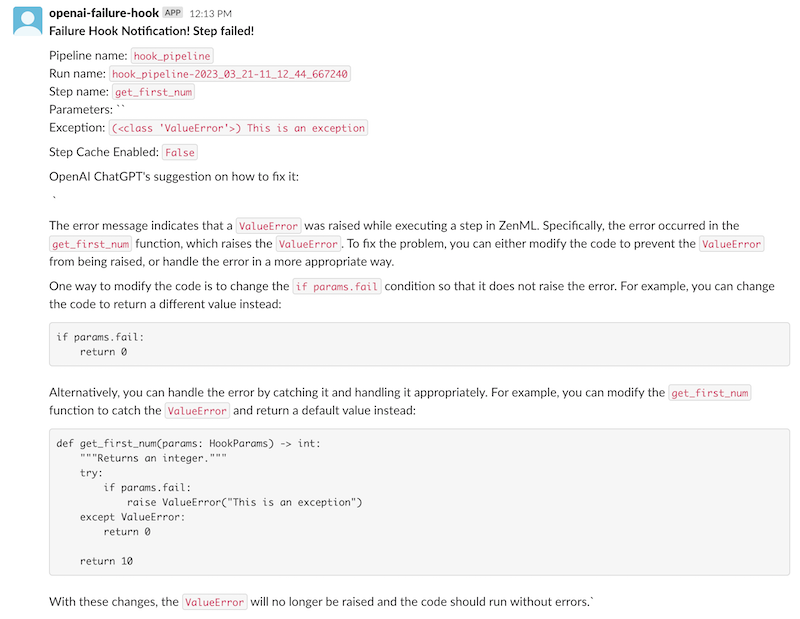

# Hooks

Hooks are a way to perform an action after a step has completed execution. They can be useful in a variety of scenarios, such as sending notifications, logging, or cleaning up resources after a step has completed.

A hook executes right after step execution, within the same environment as the step, therefore it has access to all the dependencies that a step has. Currently, there are two sorts of hooks that can be defined: `on_failure` and `on_success`.

* `on_failure`: This hook triggers in event of a step failing.
* `on_success`: This hook triggers in event of a step succeeding.

Here is a short demo for hooks in ZenML:

 Failure and Success Hooks in ZenML Short Demo 

## Defining hooks

A hook can be defined as a callback function, and must be accessible
within the repository where the pipeline and steps are located:

```python
def on_failure():
    print("Step failed!")

def on_success():
    print("Step succeeded!")

@step(on_failure=on_failure)
def my_failing_step() -> int:
    """Returns an integer."""
    raise ValueError("Error")

@step(on_success=on_success)
def my_successful_step() -> int:
    """Returns an integer."""
    return 1
```

In this example, we define two hooks: `on_failure` and `on_success`, which print a message when the step fails or succeeds, respectively. We then use these hooks with two steps, `my_failing_step` and `my_successful_step`. When `my_failing_step` is executed, it raises a `ValueError`, which triggers the `on_failure` hook. Similarly, when `my_successful_step` is executed, it returns an integer successfully, which triggers the on_success hook.

A step can also be specified as a local user-defined function
path (of the form `mymodule.myfile.my_function`). This is
particularly useful when defining the hooks via
a [YAML Config](../pipelines/settings.md).

## Defining steps on a pipeline level

In some cases, there is a need to define a hook on all steps of a given pipeline. Rather than having to define it on all steps individually, you can also specify any hook on the pipeline level. 

Note, that step-level defined hooks take precedence over pipeline-level
defined hooks.

```python
@pipeline(on_failure=on_failure, on_success=on_success)
def my_pipeline(...):
    ...
```

## Accessing step information inside a hook

A hook function signature can optionally take three type annotated arguments of
the following types:

- `StepContext`: You can pass an object inside a hook of type `StepContext` to
get access to information such as pipeline name, run name, step name etc
- `BaseParameters`: You can pass a `BaseParameters` inside the step
- `BaseException`: In case of failure hooks, if you add an `BaseException` argument to the hook,
then ZenML passes the BaseException that caused your step to fail.

Please note that in case of `BaseParameters` and `BaseException` the concrete class
defined by the step will be passed. For example, if a step's parameters class is
called `MyParameters`, that will be the object that is passed into the hook. Also,
if a `ValueError` is raised inside a step, the exception would also be of type
`BaseException`.

```python
from zenml.steps import BaseParameters, StepContext, step

# Use one or any of these in the signature
def on_failure(context: StepContext, params: BaseParameters, exception: BaseException):
    print(context.step_name)  # Output will be `my_step`
    print(type(params))  # Of type MyParameters
    print(type(exception))  # Of type value error
    print("Step failed!")


class MyParameters(BaseParameters):
    a: int = 1

@step(on_failure=on_failure)
def my_step(params: MyParameters)
    raise ValueError("My exception")
```

## Linking to the `Alerter` Stack component

A common use-case is to use the [Alerter](../../component-gallery/alerters/alerters.md)
component inside the failure or success hooks to notify relevant
people. It is quite easy to do this:

```python
def on_failure(context: StepContext):
    context.stack.alerter.post(
        f"{context.step_name} just failed!"
    )
```

ZenML provides standard failure and success hooks that use the alerter you have configured in your stack. Here's an example of how to use them in your pipelines:

```python
from zenml.hooks import alerter_success_hook, alerter_failure_hook

@step(on_failure=alerter_failure_hook, on_success=alerter_success_hook)
def my_step(...):
    ...
```

## Using the OpenAI ChatGPT Failure Hook

The OpenAI ChatGPT failure hook is a hook that uses the OpenAI integration to
generate a possible fix for whatever exception caused the step to fail. It is
quite easy to use. (You will need [a valid OpenAI API key](https://help.openai.com/en/articles/4936850-where-do-i-find-my-secret-api-key) that has correctly set
up billing for this.)


Note that using this integration will incur charges on your OpenAI account.


First ensure that you have the OpenAI integration installed
and have stored your API key within a ZenML secret:

```shell
zenml integration install openai
zenml secret create openai --api_key=<YOUR_API_KEY>
```

Then, you can use the hook in your pipeline:

```python
from zenml.integration.openai.hooks import openai_chatgpt_alerter_failure_hook

@step(on_failure=openai_chatgpt_alerter_failure_hook)
def my_step(...):
    ...
```

If you had set up a Slack alerter as your alerter, for example, then you would
see a message like this:



You can use the suggestions as input that can help you fix whatever is going
wrong in your code. If you have GPT-4 enabled for your account, you can use the
`openai_gpt4_alerter_failure_hook` hook instead (imported from the same module).
